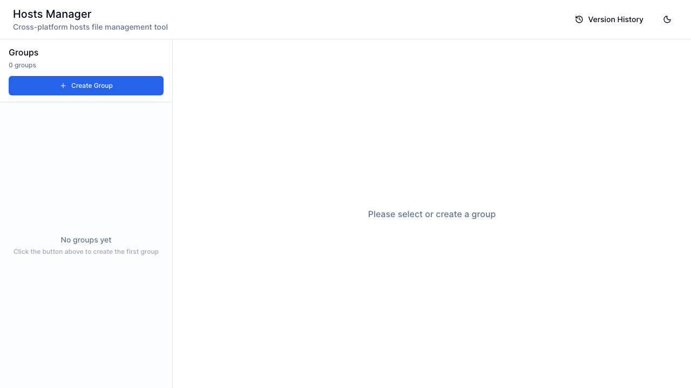
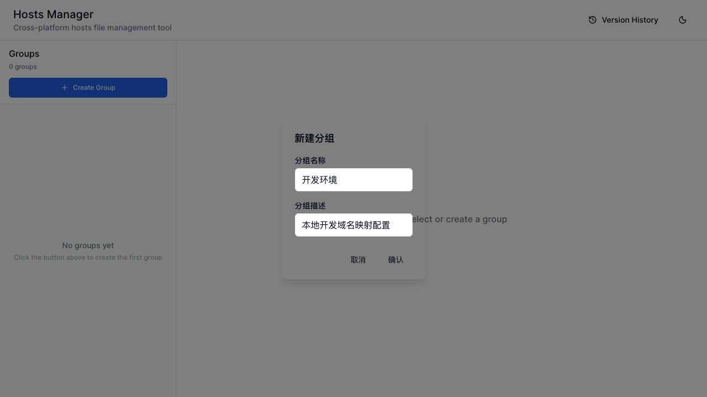
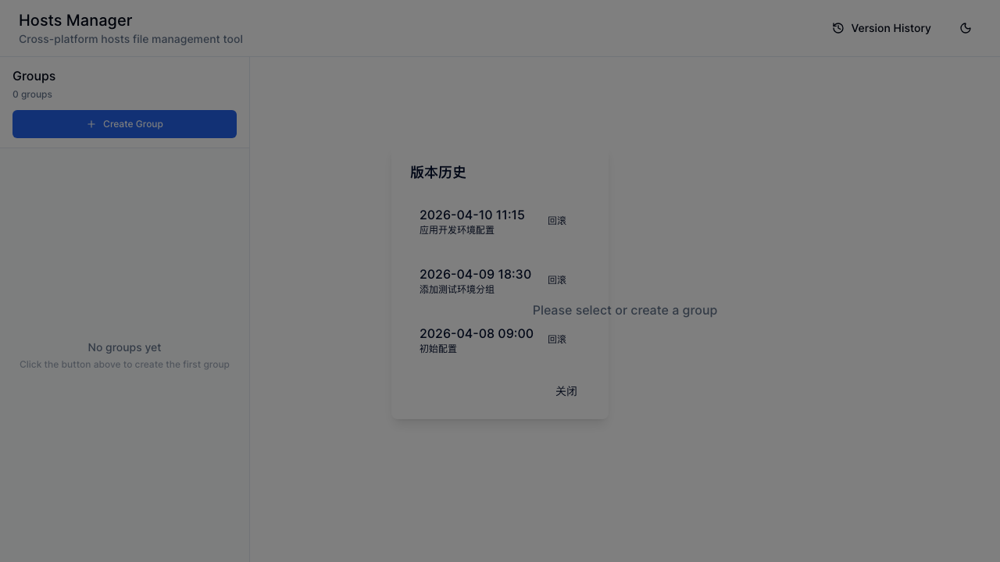

# Hosts Manager：一款现代化的跨平台 hosts 文件管理工具

## 引言

在日常开发工作中，hosts 文件的管理是开发者经常面临的痛点。无论是切换开发环境、测试环境还是生产环境，频繁修改 `/etc/hosts` 文件不仅繁琐，还容易出错。传统的文本编辑器方式效率低下，而市面上现有的 hosts 管理工具往往存在界面陈旧、功能单一、跨平台兼容性差等问题。

今天，我要向大家介绍一款全新的 hosts 文件管理工具——**Hosts Manager**。它采用最新的技术栈构建，具备现代化的界面设计、完善的分组管理功能，以及强大的版本历史记录能力，让 hosts 文件管理变得轻松高效。

---

## 软件概览

Hosts Manager 是一款基于 Wails v3 + React 开发的跨平台桌面应用，支持 macOS、Windows 和 Linux 三大操作系统。其核心设计理念是：**简单易用、功能完备、安全可靠**。



**主界面展示**：左侧分组列表、右侧编辑面板、顶部功能按钮的清晰布局

### 技术亮点

| 特性 | 描述 |
|-----|------|
| 后端技术 | Go 1.24 + Wails v3，原生性能，低内存占用 |
| 前端技术 | React 18 + Vite + Tailwind CSS + shadcn/ui |
| 架构设计 | DDD（领域驱动设计），代码清晰可维护 |
| 国际化 | 支持中文、英文、日文，自动检测系统语言 |
| 主题支持 | 明亮/暗色双主题，自动跟随系统偏好 |

---

## 核心功能介绍

### 1. 分组管理

Hosts Manager 采用分组管理的方式组织 hosts 条目，让配置管理更加有序：

- **创建分组**：点击左侧"新建分组"按钮，输入分组名称和描述即可创建
- **启用/禁用**：每个分组左侧有复选框，勾选后该分组将被应用到系统 hosts
- **分组描述**：支持添加详细描述，便于理解每个分组的用途
- **智能过滤**：空分组和未启用分组不会写入 hosts 文件



**新建分组对话框**：简洁的表单设计，支持分组名称和描述输入

**界面布局**：
- 左侧：分组列表面板，显示所有分组及其启用状态
- 右侧：hosts 条目编辑面板，支持添加、编辑、删除条目
- 顶部：版本历史、主题切换等功能按钮

### 2. Hosts 条目编辑

在选中分组后，右侧面板提供强大的编辑功能：

- **IP 地址输入**：支持 IPv4 格式验证，自动检测格式错误
- **主机名输入**：验证域名格式，防止无效输入
- **注释支持**：每个条目可添加注释说明用途
- **实时预览**：编辑后可实时查看生成的 hosts 内容

### 3. 版本历史与回滚

这是 Hosts Manager 的亮点功能之一：

- **自动备份**：每次应用配置前自动备份系统 hosts 文件
- **版本记录**：保存历史版本，包含时间戳、描述、来源信息
- **一键回滚**：选择任意历史版本即可快速回滚
- **版本清理**：自动清理过期版本（最多保留 50 个）



**版本历史界面**：时间线展示历史版本，支持一键回滚操作

### 4. 快捷键支持

为提升效率，Hosts Manager 支持全局快捷键：

- `Cmd+S` (Mac) / `Ctrl+S` (Windows/Linux)：快速保存并应用配置
- 快捷键可在编辑时立即生效，无需额外点击

### 5. 安全的权限管理

修改 hosts 文件需要管理员权限，Hosts Manager 提供了安全的处理机制：

- **智能缓存**：sudo 密码缓存 5 分钟，避免频繁输入
- **安全存储**：密码仅保存在内存中，不持久化到文件
- **自动清除**：缓存超时后自动清除，保障安全

### 6. 国际化支持

Hosts Manager 提供完整的多语言支持：

- **中文（简体）**：完整翻译，适合国内开发者
- **英文**：国际化支持，适合海外用户
- **日文**：支持日本开发者使用

语言选择遵循以下优先级：
1. 检测系统语言设置
2. 匹配支持的语言
3. 默认使用中文

---

## 生成的 hosts 文件格式

Hosts Manager 生成的 hosts 文件具有清晰的格式结构，便于识别和管理：

```hosts
# ======================================
# Generated by Hosts Manager
# Total Groups: 2
# ======================================

# ===== 开始分组: 开发环境 =====
# 描述: 本地开发域名映射配置
# 分组ID: a71c7de5-a0fd-43b2-9cb9-6438f64e8e7d
# --------------------------------------
127.0.0.1    local.api.example.com    # 本地 API 开发
127.0.0.1    local.web.example.com    # 本地 Web 开发
# ===== 结束分组: 开发环境 =====

# ===== 开始分组: 测试环境 =====
# 描述: 测试服务器域名映射
# 分组ID: b82c8ef6-b1fe-54c3-adc0-7549f75f9f8e
# --------------------------------------
192.168.1.100    test.server.com
# ===== 结束分组: 测试环境 =====
```

这种格式化的输出带来以下好处：
- **清晰分组**：每个分组有明确的开始/结束标记
- **元信息完整**：包含组名、描述、ID 等信息
- **便于调试**：出现问题时可快速定位来源
- **手动编辑友好**：即使手动修改 hosts 文件，也能识别分组

---

## 使用场景

### 场景 1：多环境开发

开发者在不同环境下工作需要不同的 hosts 配置：

```
开发环境分组:
├── 本地开发服务器 (127.0.0.1)
├── 测试环境服务器 (192.168.x.x)
└── 临时调试配置

生产环境分组:
├── 生产服务器域名
├── 线上测试域名
```

通过启用/禁用分组，一键切换环境配置。

### 场景 2：团队协作

团队成员可以共享 hosts 配置方案：

- 导出配置文件分享给同事
- 统一命名规范便于理解
- 版本历史帮助追溯修改

### 场景 3：测试域名解析

在测试新域名或 DNS 变更时：

- 快速添加临时映射
- 测试完成后一键禁用
- 版本回滚恢复原始状态

---

## 快速开始

### 安装要求

- Go 1.24+（仅开发需要）
- Node.js 18+（仅开发需要）
- Wails v3 CLI（仅开发需要）

### 获取应用

```bash
# 克隆项目
git clone https://github.com/your-repo/wails3-hosts.git
cd wails3-hosts

# 开发模式运行
wails3 dev

# 生产构建
wails3 build
```

构建产物位于 `build/bin/` 目录。

### 基本使用流程

1. **启动应用**：运行 Hosts Manager
2. **创建分组**：点击"新建分组"，输入名称和描述
3. **添加条目**：选择分组，添加 IP 地址和主机名
4. **启用分组**：勾选分组复选框使其生效
5. **应用配置**：点击"应用配置"按钮，输入 sudo 密码

---

## 配置文件位置

Hosts Manager 的配置文件存储在系统标准位置：

| 平台 | 路径 |
|-----|------|
| macOS | `~/Library/Application Support/hosts-manager/` |
| Linux | `~/.config/hosts-manager/` |
| Windows | `%APPDATA%\hosts-manager\` |

配置文件结构：
```
hosts-manager/
├── config.json       # 分组配置
├── versions.json     # 版本历史
└── backups/          # hosts 文件备份
```

---

## 安全设计

Hosts Manager 在安全方面进行了周密设计：

### 密码安全

- 密码仅在内存中保存，不写入任何文件
- 缓存机制使用加密存储
- 5 分钟超时自动清除

### 输入验证

- IP 地址格式严格验证
- 主机名格式验证防止注入
- 限制单分组最大条目数防止性能问题

### 备份机制

- 应用配置前自动备份系统 hosts
- 保留最近 5 个备份文件
- 备份文件包含时间戳便于识别

---

## 未来规划

Hosts Manager 持续迭代，未来将支持：

- [ ] 远程同步（GitHub Gist、Gitee）
- [ ] 配置导入/导出
- [ ] 定时切换（工作时间/开发环境）
- [ ] 命令行接口（CLI）
- [ ] 系统托盘图标
- [ ] hosts 模板和预设方案

---

## 总结

Hosts Manager 是一款专为开发者设计的现代化 hosts 文件管理工具。它解决了传统 hosts 管理方式的痛点，通过分组管理、版本历史、快捷键支持等功能，大幅提升了开发效率。

如果你经常需要修改 hosts 文件，或者管理多个环境的域名映射，Hosts Manager 将是你的得力助手。赶快尝试一下吧！

---

**项目地址**：[GitHub 仓库链接]

**技术支持**：欢迎提交 Issue 和 Pull Request！

**许可证**：MIT License