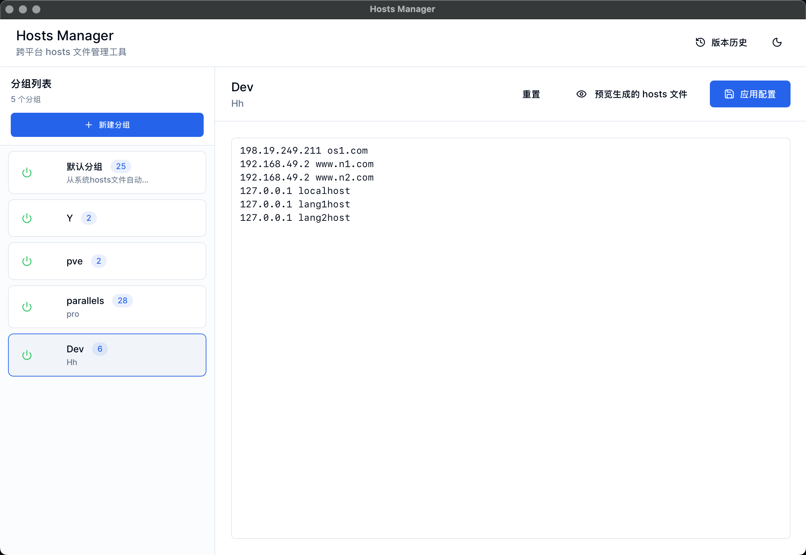
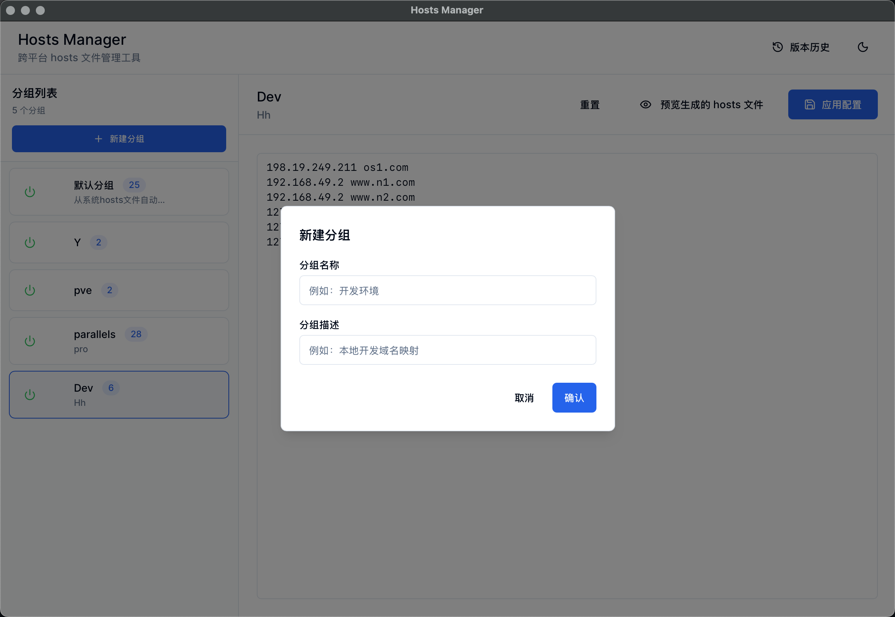

# HostsManager

HostsManager is a powerful and easy-to-use hosts file management tool designed to help users effortlessly manage their local hosts file, quickly switch between different hosts configurations, and resolve domain access issues.

## Features

- **Simple and Intuitive Interface** - An intuitive graphical interface for easy management of hosts entries  
- **Quick Switching** - One-click switching between different hosts configuration profiles
- **Multi-Platform Support** - Supports Windows, macOS, and Linux systems
- **Import and Export** - Conveniently import and export hosts configurations
- **History Tracking** - Maintains configuration history for easy rollback
- **Secure and Reliable** - Automatically backs up before any operation to ensure data safety

## Interface Preview

## Download

Choose the appropriate version for your operating system:

- Windows Version
- macOS Version
- Linux Version

## Usage Instructions

1. Download and install the version for your platform
2. Launch the application
3. Add or import hosts entries
4. Select the configuration you wish to enable
5. Save and apply

## Technology Stack

- Frontend Interface: Tailwind CSS  
- Deployment Platform: Cloudflare Workers

## Open Source License

This project is intended solely for learning and communication purposes.